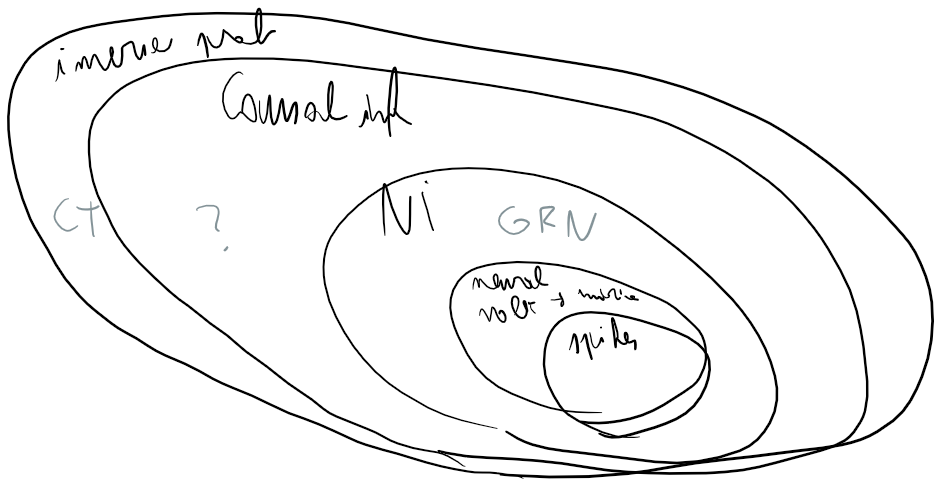

## Network inference

In this PhD, we want to [[reconstruct synaptic connectivity in the brain by only looking at neurons' somatic voltages]]. Or, more abstractly: we want to infer the [[link]]s in a network from the activity of its [[node]]s.

There are other domains in science and technology where we want to do this. Take [[gene regulatory network]]s. Genes often code for molecules that enhance or suppress the expression of other genes. These biophysical interactions are difficult to measure. It is much easier to measure concentrations of gene products in a cell.\* The problem is then to find such gene interactions from gene expression levels alone. (These gene expression levels may or not be temporal, i.e. time series versus temporal snapshots).

* "single-cell RNA sequencing" (scRNA-seq) is a recent technique that measures abundance levels of different gene products. It has taken cell biology by storm.

In both [[our problem]] and for [[gene regulatory network]]s, we want to know which entities interact with which, but cannot directly measure these interactions. Rather, we have data on the individual activities of the entities. And from this data, we want to reconstruct the network. This is what is meant by "network inference".

When searching Google Scholar for "network inference", most results concern gene regulatory networks. Other common themes are earth/climate science, and our interest: neural networks. But really the applications of network inference are all over the place: one paper predicts which electronic devices transmit to which based only on packet arrival times. Another looks at pigeon flocks, and predicts which bird follows which based on their positions and velocities alone.[^a]

[^a]: Both the electronic packets and the pigeon references I found through [[Sun et al (2015)]].

## Causal inference & inverse problems

If we generalise even further — and with each generalisation we lose some precision and applicability to [[our problem]] — we might say that network inference is an instance of [[causal inference]] and hence an [[inverse problem]].[^b]

[^b]: [[Maclaren & Nicholson (2019)]] states that causal inference is a subtype of inverse problems.

Framed as a [[causal inference]] problem, we want to determine which voltage traces (the 'random variables') are the direct cause of which other voltage traces; and hence which neurons synapse onto which.

Framed as an [[inverse problem]]: we have a decent idea of how a given neural network generates voltage traces (the 'forward' map $F$). That is, we can simulate neural voltages quite realistically (using Hodgkin-Huxley-like differential equations) when we know parameter values such as the network connectivity, the network input, and the properties of the neurons and their connections:
$$
\text{voltage traces} = F( \text{network parameters \& input} )
$$
Our problem, the inverse problem, is then to find $F^{-1}$. Given voltage traces, we could then find the network connectivity (as well as other parameters and the network input).

This framing makes clear that the inverse map "voltages ⇔ connectivity", which might be deduced from our original problem statement, is too simplistic. The same connectivity matrix might generate different types[^c] of voltage traces, depending on input given to the network and network parameters (such as conduction delays and whether neurons are inhibitory or excitatory).

[^c]: I mean 'different types' in the nonlinear dynamical systems sense, as in [[Strogatz's book]]: where the entire system bifurcates between qualitatively different behaviours, not just quantitative, 'smooth' differences.

Figure caption:
Hierarchy of computational problems related to network inference.
*"Spikes-only" neural network inference* is not drawn as a strict subset of voltage based inference -- even though a clean voltage trace shows all spikes. This is because spikes-only based inference is often based on [[calcium imaging]] data, and [[calcium imaging does not really measure spike times]].

The benefit of abstracting our problem like this is knowing where to look for inspiration for solution methods. Namely, in the network inference, causal inference, and inverse problem literatures. Because these are so large (the majority of problems in computational science and engineering can be framed as causal inference or inverse problems), we will limit ourselves mostly to the *neural* network inference literature.